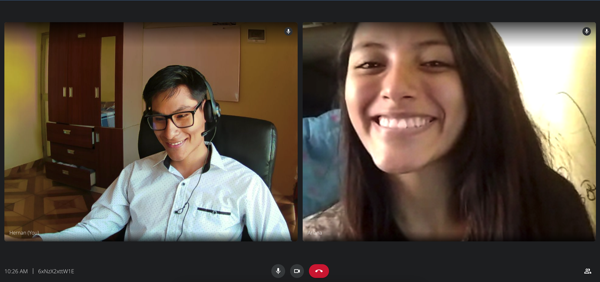
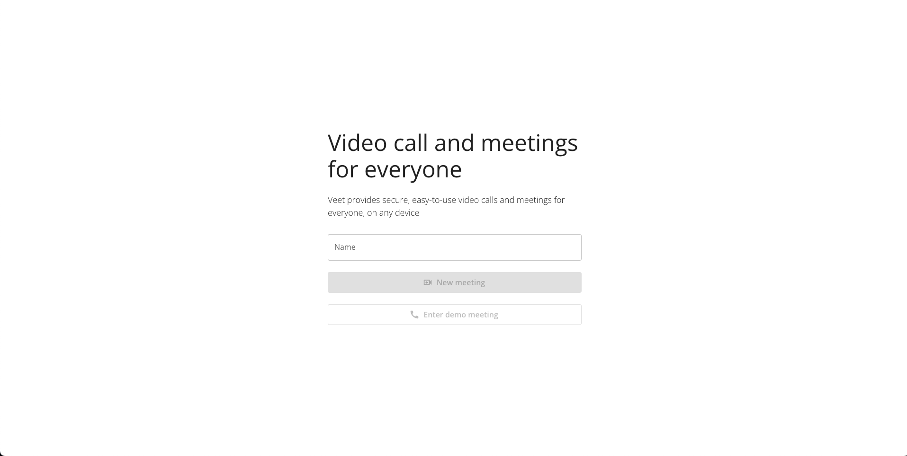
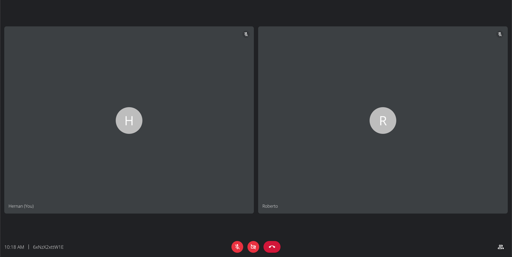
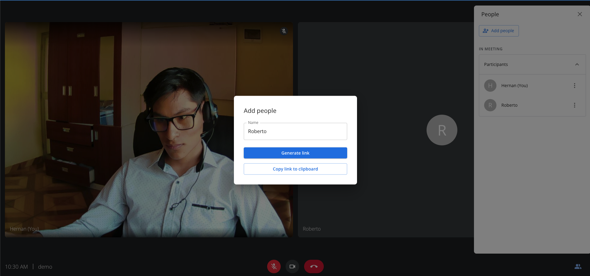

# Veet - Open source video conferencing as a service



Veet is a full-stack clone of Google Meet, implemented in frontend with React.js, Node.js backend and deployed to AWS.

## Mono-repository sctructure

```js
+-- apps
|   +-- api // main API Rest service for the application
|   +-- web // frontend application
+-- docs // docs assets
|   +-- screenshoots // full deployed application screenshoots
+-- infra // Infrastructure as code with AWS CDK in typescript for deploying the app (comming soon)
+-- package.json // main package.json for the mono repository
+--
```

## Screenhoots




